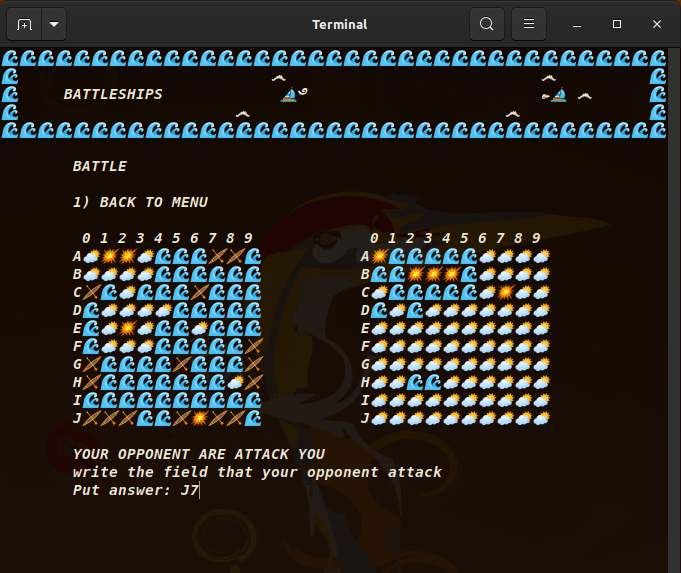
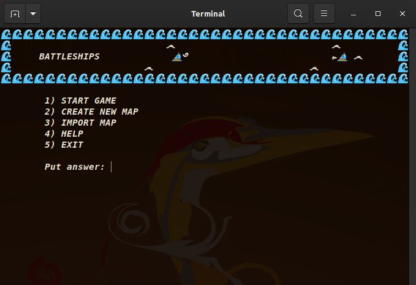
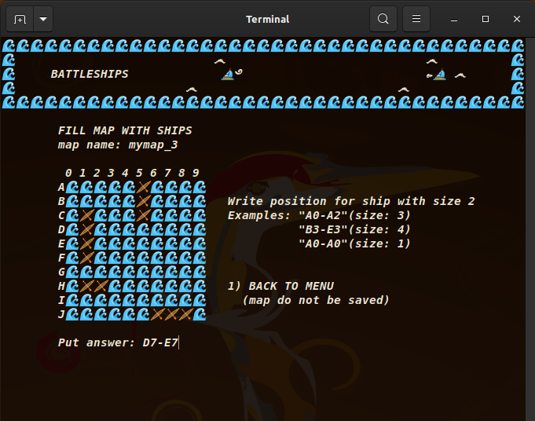

# IObattleShips
Console battleships on two PC (not online\through messenger).

DESCRIPTION

Central idea is that you create map, your friend create map.
Then you exchanges maps via internet apps. Now you and your friend
can battle with each other from different place through online
messengers.

 

GAME IS NEED terminal that support Unicode
to put emoji-like symbols;

There is need to write "help", some tests, find and fix bugs.
Also add several interesting features (password for map,
battle animation).
